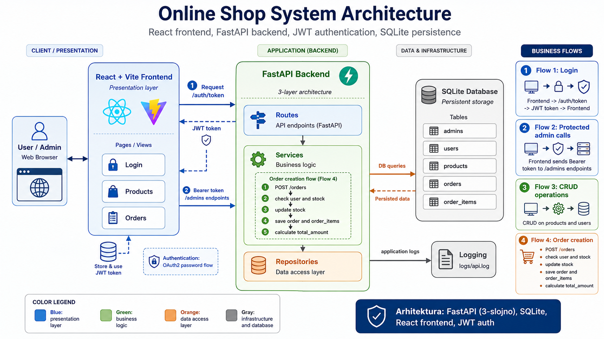
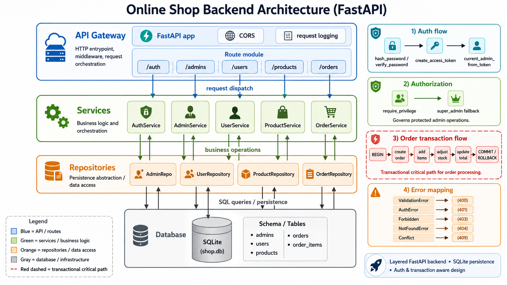

# Online Shopping API and Admin Panel

<p align="center">
  Full-stack online shop project built with FastAPI, SQLite, and React.
</p>

<p align="center">
  
  
  
  
  
  
  
</p>

---

## Overview

This project is a portfolio-ready online shopping system with:
- FastAPI backend API
- React + Vite admin frontend
- SQLite database
- JWT authentication and privilege-based admin authorization
- Three-layer backend architecture: Routes -> Services -> Repositories

---

## Architecture Visuals

### System Architecture



### Backend Architecture



---

## Core Features

- User management with CRUD and search
- Product catalog with stock tracking
- Order creation with transactional stock updates and total calculation
- Admin panel authentication with OAuth2 password flow and JWT
- Role and privilege checks for admin endpoints
- Pagination support on list endpoints
- Swagger and ReDoc API documentation

---

## Tech Stack

- Backend: FastAPI, Pydantic, Uvicorn
- Database: SQLite
- Security: JWT, OAuth2 password flow, PBKDF2 password hashing
- Frontend: React, Vite
- Containerization: Docker, Docker Compose
- Testing: Pytest

---

## Project Structure

```text
data/            Database setup, schema, migrations
docs/            Technical documentation and prompts
frontend/        React + Vite admin interface
IO/              Pydantic input/output models
repositories/    Data access layer
routes/          FastAPI route handlers
services/        Business logic layer
tests/           Automated tests (auth and orders)
```

---

## Local Setup

Setup instructions were moved to:
- [docs/local-setup.md](docs/local-setup.md)

---

## Authentication Quick Start

Authentication guide was moved to:
- [docs/authentication-quick-start.md](docs/authentication-quick-start.md)

---

## Testing

```powershell
python -m pytest -q
```

Current tests cover:
- Auth success and negative flows
- Order creation, listing/details, and negative stock scenario

---

## Security and Environment

Configuration example is available in .env.example.

Important variables:
- APP_ENV
- JWT_SECRET_KEY
- CORS_ALLOW_ORIGINS
- CORS_ALLOW_CREDENTIALS
- ALLOWED_HOSTS

For production:
- set a strong JWT secret
- restrict CORS to known domains
- restrict trusted hosts

---

## Documentation

Detailed docs are available in the docs folder:
- docs/system-architecture.md
- docs/backend-detailed.md
- docs/local-setup.md
- docs/authentication-quick-start.md